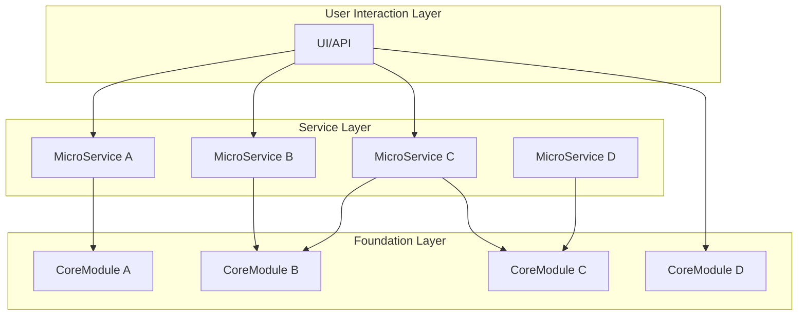
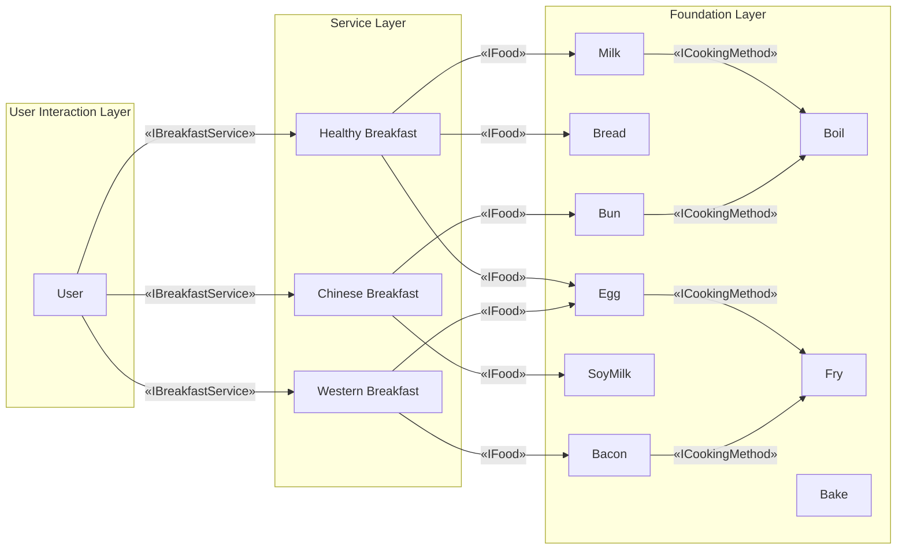
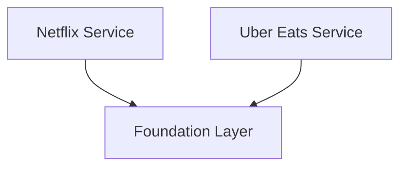
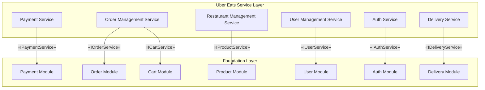
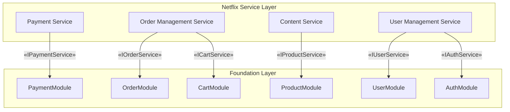

# Challenge of Building a Scalable System with Modular Layered Architecture


## Part 1: Introduction - The Challenge of Building a Scalable System

In system design, scalability is critical—not only to meet current needs but also to adapt to future changes. However, building scalable systems often presents the following challenges:

- How to maintain low coupling between modules?
- How to clearly define the responsibilities of each module while controlling complexity?

This article introduces a three-tier modular architecture to demonstrate how to enhance the flexibility, maintainability, and reusability of systems.

## Part 2: Problem - Core Design Challenges

Major design challenges in building scalable systems:

1. **The contradiction between scalability and complexity management**  
   While system expansion requires modules to remain independent, increasing the number of modules can complicate maintenance.

   **Core issue**：How to ensure that modules have clear responsibilities and maintain low coupling?

2. **Balancing development and maintenance costs**  
   Without reuse mechanisms, redundant development can increase costs.

   **Core issue**：How can modular design reduce repetitive work and improve maintenance efficiency?

3. **Trade-offs between flexibility and performance**  
   Overly flexible designs can increase complexity, while overly simplistic designs may fail to meet future needs. In high-concurrency scenarios, communication between modules can also impact performance.

   **Core issue**：How to ensure flexibility without over-engineering while maintaining performance?

4. **Module isolation and security**  
   Insufficient isolation between modules can lead to security issues, and failures in one module can affect the entire system.

   **Core issue**：How to ensure security through effective module isolation?

## Part 3: Solution - Modular Design and Key Principles

1. **Module Independence and Isolation**  
   By using a modular architecture, we achieve decoupling of functionality, deployment, and development across modules. A three-tier architecture ensures unidirectional dependencies between modules, reducing coupling and enhancing scalability.

   - Functional independence: Modules communicate via interfaces, avoiding excessive dependencies, enabling independent development and maintenance.
   - Security isolation: A zero-trust architecture ensures secure communication between modules, preventing module failures from affecting the entire system.

2. **Component Reuse and Standardization**  
   Introducing a standardized component library allows all modules to be developed based on uniform interfaces, reducing redundancy and improving module reusability.

   - Component library: A unified component library increases development efficiency and reduces workload.
   - Versioning and dependency control: Through version control and dependency management, we ensure compatibility during module updates, reducing maintenance difficulties.

3. **Progressive Optimization**  
   Early designs prioritize flexibility, while asynchronous processing mechanisms are introduced later to optimize performance, especially in high-concurrency scenarios.

   - Early design: Focus on flexibility for functional expansion, allowing rapid response to changes.
   - Performance optimization: In high-concurrency scenarios, asynchronous processing and resource scheduling mechanisms improve system performance.

4. **分层架构与灵活设计**
   The three-tier architecture (core layer, service layer, user interaction layer) ensures separation of concerns and flexible expansion. The core layer handles essential functionality, the service layer implements business logic, and the user interaction layer simplifies interaction with external systems.

   - Unidirectional dependencies: Higher layers depend only on lower layers, avoiding circular dependencies and improving maintainability.
   - Flexible expansion: Modular design allows the system to expand without altering the overall architecture.

## Part 4: Three-Layer System Design - Practical Application

his design follows the principles of `Clean Architecture` and `Domain-Driven Design (DDD)`, ensuring unidirectional dependencies across layers. In certain scenarios (where the core layer has already implemented comprehensive and stable business logic), the user interaction layer can directly invoke the foundational layer’s functions to reduce the call chain and improve performance. This design helps reduce latency and complexity, but care must be taken to ensure security in cross-layer calls.



Three-Tier Architecture:

1. **Foundation Layer**
   The foundation layer contains core functionality interfaces and some default implementations, providing highly cohesive foundational features that can flexibly adapt to business needs. In simple scenarios, the user interaction layer can bypass the service layer and directly call foundation layer functions, but security must be ensured, such as using OAuth or JWT mechanisms for cross-layer security.

2. **Service Layer**
   The service layer combines different business logic scenarios based on core modules, allowing flexible adjustments to meet user needs. It makes the system easier to expand.

   The service layer design draws inspiration from microservices architecture, aiming to achieve module independence, enabling parallel development and independent deployment by different teams, while maintaining flexibility for expansion.

3. **User Interaction Layer**
   The user interaction layer simplifies the interfaces and interactions with users, hiding internal complexity and ensuring efficient and straightforward user operations.

## Part 5: Real-Life Example and Code Walkthrough - Modular Breakfast Planning

To provide a more intuitive understanding of complex system design, here is a "Modular Breakfast Plan" to illustrate the concept. The breakfast menu is designed according to different cultures and lifestyles, similar to how businesses meet diverse customer needs.



### 1. Foundation Layer - Basic Modules

The foundation layer defines all the essential ingredients and operational logic. Users can directly invoke default functions from the foundation layer, reducing complexity. For example, adding a new ingredient like "oatmeal" can be done without modifying other parts, allowing easy reuse.

```typescript
// breakfast-module

// Define the Breakfast Item interface
export interface IBreakfastItem {
  getName(): string; // Get the food name
  getCalories(): number; // Get the food calories
  getCookingMethods(): ICookingMethod[]; // Get cooking methods
  customData?: any; // Customizable data extension
}

// Define the Cooking Method interface
export interface ICookingMethod {
  getName(): string; // Get the name of the cooking method
  getDescription(): string; // Get the description of the cooking method
}

// Implement a common cooking method - Boiling
export class Boiling implements ICookingMethod {
  getName(): string {
    return "Boiling";
  }

  getDescription(): string {
    return "Heat the food in water until it boils.";
  }
}

// Implement a common cooking method - Frying
export class Frying implements ICookingMethod {
  getName(): string {
    return "Frying";
  }

  getDescription(): string {
    return "Cook the food in hot oil.";
  }
}

// Define the Breakfast Service interface - IBreakfastService
export interface IBreakfastService {
  getBreakfastItem(name: string): IBreakfastItem | undefined; // Get a single breakfast item
  getBreakfastItems(): IBreakfastItem[]; // Get all breakfast items
}

// Define the default Breakfast Service implementation - DefaultBreakfastService
export class DefaultBreakfastService implements IBreakfastService {
  private repository: IBreakfastServiceRepository;

  constructor(repository: IBreakfastServiceRepository) {
    this.repository = repository;
  }

  // Get a single breakfast item
  getBreakfastItem(name: string): IBreakfastItem | undefined {
    return this.repository.getItem(name);
  }

  // Get all breakfast items
  getBreakfastItems(): IBreakfastItem[] {
    return this.repository.getAllItems();
  }
}

//  Define the Breakfast Service Manager interface - IBreakfastServiceManager
export interface IBreakfastServiceManager {
  registerService(name: string, service: IBreakfastService): void; // Register a service
  getBreakfastItems(serviceName: string): IBreakfastItem[] | undefined; // Get all breakfast items under a service
  getBreakfastItem(
    serviceName: string,
    itemName: string
  ): IBreakfastItem | undefined; // Get a single breakfast item under a service
}

// Default implementation - DefaultBreakfastServiceManager
export class DefaultBreakfastServiceManager
  implements IBreakfastServiceManager
{
  private services: { [key: string]: IBreakfastService } = {};

  // Register a service
  registerService(name: string, service: IBreakfastService): void {
    this.services[name] = service;
  }

  // Get all breakfast items under a specific service
  getBreakfastItems(serviceName: string): IBreakfastItem[] | undefined {
    const service = this.services[serviceName];
    return service ? service.getBreakfastItems() : undefined;
  }

  // Get a single breakfast item under a specific service
  getBreakfastItem(
    serviceName: string,
    itemName: string
  ): IBreakfastItem | undefined {
    const service = this.services[serviceName];
    return service ? service.getBreakfastItem(itemName) : undefined;
  }
}

// Define the Breakfast Service Repository interface - IBreakfastServiceRepository
export interface IBreakfastServiceRepository {
  getItem(name: string): IBreakfastItem | undefined; // Get a single breakfast item from the repository
  getAllItems(): IBreakfastItem[]; // Get all breakfast items from the repository
}

// Define the default Breakfast Service Repository implementation - DefaultBreakfastServiceRepository
export class DefaultBreakfastServiceRepository
  implements IBreakfastServiceRepository
{
  private items: IBreakfastItem[] = [];

  constructor(items: IBreakfastItem[]) {
    this.items = items;
  }

  // Get a single breakfast item by name
  getItem(name: string): IBreakfastItem | undefined {
    return this.items.find((item) => item.getName() === name);
  }

  // Get all breakfast items
  getAllItems(): IBreakfastItem[] {
    return this.items;
  }
}
```

### 2. Service Layer - Scenario Composition Modules

The service layer combines core modules into different breakfast services. For instance, the ChineseService offers buns and soy milk, while the WesternService provides bacon and eggs. The service layer can be flexibly adjusted according to needs without affecting the underlying implementation.

```typescript
// chinese-breakfast/index.ts
import {
  IBreakfastService,
  AbstractBreakfastItem,
  ICookingMethod,
  Boiling,
} from "breakfast-oss";

// Specific cooking method for Chinese breakfast
class StirFrying implements ICookingMethod {
  getName(): string {
    return "Stir Frying";
  }

  getDescription(): string {
    return "Quickly cook food with a small amount of oil in a pan.";
  }
}

// Implement a concrete Chinese breakfast item
export class ChineseBreakfastService implements IBreakfastService {
  private items: IBreakfastItem[] = [];

  constructor() {
    this.items = [
      {
        getName: () => "Congee",
        getCalories: () => 120,
        getCookingMethods: () => [new Boiling()],
      },
      {
        getName: () => "Baozi",
        getCalories: () => 200,
        getCookingMethods: () => [],
      },
      {
        getName: () => "Soy Milk",
        getCalories: () => 100,
        getCookingMethods: () => [],
      },
    ];
  }

  // Get a single breakfast item
  getBreakfastItem(name: string): IBreakfastItem | undefined {
    return this.items.find((item) => item.getName() === name);
  }

  // Get all Chinese breakfast items
  getBreakfastItems(): IBreakfastItem[] {
    return this.items;
  }
}

// western-breakfast/index.ts
import {
  IBreakfastService,
  AbstractBreakfastItem,
  ICookingMethod,
  Frying,
} from "breakfast-oss";

// Implement a concrete Western breakfast item
export class WesternBreakfastService implements IBreakfastService {
  private items: IBreakfastItem[] = [];

  constructor() {
    this.items = [
      {
        getName: () => "Fried Egg",
        getCalories: () => 220,
        getCookingMethods: () => [new Frying()],
      },
      {
        getName: () => "Bacon",
        getCalories: () => 250,
        getCookingMethods: () => [new Frying()],
      },
    ];
  }

  // Get a single breakfast item
  getBreakfastItem(name: string): IBreakfastItem | undefined {
    return this.items.find((item) => item.getName() === name);
  }

  // Get all Western breakfast items
  getBreakfastItems(): IBreakfastItem[] {
    return this.items;
  }
}
```

### 3. User Interaction Layer - Final Breakfast Selection

Users don’t need to worry about the underlying logic. They simply choose their breakfast service, and the system automatically combines the relevant modules to generate the corresponding menu.

```typescript
// Get and display Chinese breakfast items
const manager = new DefaultBreakfastServiceManager();
manager.registerService("Chinese", new ChineseBreakfastService());

const chineseBreakfast = manager.getBreakfastItems("Chinese");
chineseBreakfast?.forEach((item) => {
  console.log(
    `Chinese Breakfast - Name: ${item.getName()}, Calories: ${item.getCalories()}`
  );
  item.getCookingMethods().forEach((method) => {
    console.log(
      `  Cooking Method: ${method.getName()} - ${method.getDescription()}`
    );
  });
});
```

```typescript
// Get and display Western breakfast items
const manager = new DefaultBreakfastServiceManager();
manager.registerService("Western", new WesternBreakfastService());
const westernBreakfast = manager.getBreakfastItems("Western");
westernBreakfast?.forEach((item) => {
  console.log(
    `Western Breakfast - Name: ${item.getName()}, Calories: ${item.getCalories()}`
  );
  item.getCookingMethods().forEach((method) => {
    console.log(
      `  Cooking Method: ${method.getName()} - ${method.getDescription()}`
    );
  });
});
```

## Part 6: Uber Eats and Netflix Services Example and Code Walkthrough – Modular Layered Architecture Approach

By using examples from Uber Eats and Netflix, we can show how modular architecture can manage different services, ensuring system scalability.



Both Netflix and Uber Eats share common logic through the foundation layer, ensuring modularity and scalability.

### Three-Tier Modular Architecture

Below is the three-tier modular architecture for Uber Eats and Netflix services, showing how to organize these modules and connect the service layer with the foundation layer through interfaces.





#### Uber Eats Service List

For Uber Eats, the service layer depends on several services that work together to complete business logic:

1. Payment Service: Handles order payments, refunds, and status updates, integrating with third-party payment gateways.
2. Delivery Service: Manages delivery scheduling, task allocation, status updates, and real-time tracking of delivery personnel.
3. Order Management Service: Handles order creation, updates, cancellations, and manages order statuses (e.g., pending, in delivery, completed).
4. User Management Service: Manages the registration, login, and information for buyers, sellers, and delivery personnel, including address and payment information.
5. Restaurant Management Service: Manages restaurant information and the addition, update, and deletion of items.

#### Netflix Service List

The Netflix service layer includes the following services:

1. User Management Service: Manages user registration, login, information, and preferences, handling user authentication and authorization.
2. Content Service: Manages the addition, update, and deletion of movies, series, and other content, offering classification, search, and recommendation features.
3. Order Management Service: Handles order creation, updates, cancellations, and manages order statuses.
4. Payment Service: Manages subscription payments and refunds, integrating payment gateways to ensure payment security.

#### Foundation Layer

The foundation layer consists of core modules for product and user management:

1. Product Management Functions:

- Product Module: Manages product addition, updates, deletion, and inventory control.
- Order Module: Handles order creation, updates, cancellations, and manages order statuses.
- Payment Module: Manages payment logic and tracks payment statuses.
- Cart Module: Manages the addition, removal, and checkout of items in the shopping cart.

2. User Management Functions:

- User Module: Handles user registration, updates, and management of user information.
- Auth Module: Provides user authentication and permission management.

Here’s a code example of the Product Management Module:

```typescript
// Product Module: Manages product addition, updates, and stock control.
// Product Entity Interface
export interface IProduct<CustomProps = {}> {
  id: string;
  name: string;
  price: number;
  stock: number;
  customProps?: CustomProps;
}

// Product Repository Interface - Provides data operation methods
export interface IProductRepository<TProduct = IProduct> {
  addProduct(product: TProduct): Promise<void>;
  updateProduct(product: TProduct): Promise<void>;
  deleteProduct(productId: string): Promise<void>;
  getProductById(productId: string): Promise<TProduct | null>;
  getAllProducts(): T[];
}

// Product Service Interface
export interface IProductService<TProduct = IProduct> {
  addProduct(product: TProduct): Promise<void>;
  updateProduct(product: TProduct): Promise<void>;
  deleteProduct(productId: string): Promise<void>;
  getProductById(productId: string): Promise<TProduct | null>;
  getAllProducts(): T[];
}

// Foundation Layer: Default implementation of product services - Data managed using repository
export class ProductService<TProduct = IProduct>
  implements IProductService<TProduct>
{
  constructor(private repository: IProductRepository<TProduct>) {}

  async addProduct(product: TProduct): Promise<void> {
    await this.repository.addProduct(product);
  }

  async updateProduct(product: TProduct): Promise<void> {
    await this.repository.updateProduct(product);
  }

  async deleteProduct(productId: string): Promise<void> {
    await this.repository.deleteProduct(productId);
  }

  async getProductById(productId: string): Promise<TProduct | null> {
    return await this.repository.getProductById(productId);
  }

  async getAllProducts(): Promise<TProduct[]> {
    return await this.repository.getAllProducts();
  }
}
```

#### Custom Implementations in the Service Layer

The service layer can extend the foundation layer's logic based on business needs. For example:

Uber Eats Custom Implementation Example

```typescript
// Uber Eats-specific custom properties
interface UberEatsCustomProps {
  restaurantId: number;
  ownerId: number;
}

// Uber Eats product type, using generics to extend custom properties
export type UberEatsProduct = IProduct<UberEatsCustomProps>;

// Uber Eats Product Service - Custom logic implemented by composing the base service
export class UberEatsProductService {
  constructor(private productService: ProductService<UberEatsProduct>) {}

  // Custom function: Get menu by restaurant ID
  async getMenuByRestaurant(restaurantId: string): Promise<UberEatsProduct[]> {
    const allProducts = await this.productService.getAllProducts();
    return allProducts.filter(
      (p) => p.customProps?.restaurantId === restaurantId
    );
  }
}
```

Netflix Custom Implementation Example

```typescript
// Netflix-specific custom properties
interface NetflixCustomProps {
  releaseDate: string;
}

// Netflix product type, using generics to extend custom properties
export type NetflixProduct = IProduct<NetflixCustomProps>;

// Netflix Product Service Implementation, overriding all methods of IProductService
export class NetflixProductService implements IProductService<NetflixProduct> {
  private products: NetflixProduct[] = [];

  // Add product
  async addProduct(product: NetflixProduct): Promise<void> {
    this.products.push(product);
  }

  // Update product
  async updateProduct(product: NetflixProduct): Promise<void> {
    const index = this.products.findIndex((p) => p.id === product.id);
    if (index !== -1) {
      this.products[index] = product;
    }
  }

  // Delete product
  async deleteProduct(productId: string): Promise<void> {
    this.products = this.products.filter((product) => product.id !== productId);
  }

  // Get product by ID
  async getProductById(productId: string): Promise<NetflixProduct | null> {
    return this.products.find((product) => product.id === productId) || null;
  }

  // Get all products
  async getAllProducts(): Promise<NetflixProduct[]> {
    return this.products;
  }

  // Netflix-specific logic: Sort products by release date
  async sortByReleaseDate(): Promise<NetflixProduct[]> {
    return this.products.sort(
      (a, b) =>
        new Date(a.customProps?.releaseDate).getTime() -
        new Date(b.customProps?.releaseDate).getTime()
    );
  }
}
```

## Part 7: Key Design Principles - SOLID and DDD

In modular design, following the SOLID principles and Domain-Driven Design (DDD) significantly enhances the maintainability, scalability, and flexibility of the code. Below, we'll use the previously mentioned code to explain these design principles.

#### SOLID 原则的应用

1. Single Responsibility Principle (SRP):
   In the breakfast planning example, each module (e.g., IBreakfastService, IBreakfastServiceRepository) has a distinct responsibility. IBreakfastService is responsible for providing breakfast items, while IBreakfastServiceRepository focuses on data access logic. This separation ensures that changes in one module don't affect others, improving code maintainability.

2. Open/Closed Principle (OCP):
   In the breakfast service layer, new breakfast types (e.g., "Western breakfast" or "Chinese breakfast") can be implemented by extending the IBreakfastService interface without modifying existing code. This design allows the system to expand without altering the core logic.

3. Liskov Substitution Principle (LSP):
   In the Uber Eats and Netflix frameworks, any class implementing the IProductService interface can be seamlessly substituted without disrupting the system. This allows for easy replacement or extension of different product service implementations based on business needs.

4. Interface Segregation Principle (ISP):
   By separating service interfaces (e.g., IPaymentService and IOrderService), each service only needs to implement functions relevant to its role, avoiding the need to implement unnecessary functionality. This design reduces unnecessary dependencies, making the system clearer and easier to understand and implement.

5. Dependency Inversion Principle (DIP):
   Classes generally depend on abstract interfaces rather than concrete implementations. For example, DefaultBreakfastService depends on the IBreakfastServiceRepository interface, allowing for easy repository replacement through dependency injection, improving system flexibility.

#### Domain-Driven Design (DDD) Principles:

1. Domain Models:
   In the breakfast planning, Uber Eats, and Netflix frameworks, the foundation layer defines domain objects (e.g., IBreakfastItem, IProduct) that reflect business rules and requirements, ensuring system robustness and domain consistency.

2. Aggregate Roots:
   In the Uber Eats and Netflix frameworks, IProductService serves as the core interface managing product-related information. It acts as the aggregate root, ensuring that all product-related operations adhere to established business rules, preventing data inconsistency.

3. Bounded Context:
   The business logic of different services (e.g., Uber Eats and Netflix) is isolated through clear context boundaries, ensuring that the logic of each service does not interfere with others, making the system easier to extend.

4. Repository Pattern:
   Interfaces like IBreakfastServiceRepository and IProductRepository provide an abstraction layer for data access, ensuring the separation of domain logic from data access logic. This design allows future replacements of the data access layer without affecting core business logic.

## Part 8: Scalability and Flexibility

### Example Comparison: Non-Modular Design vs. Modular Design

**Scenario 1: Adding a JapaneseBreakfastService**
Requirement: Implement a service class JapaneseBreakfastService that combines rice and miso soup to generate a Japanese breakfast.

1. **Non-Modular Design Implementation**  
   In a non-modular design, all the food items and logic are mixed within a single class. If more Japanese breakfast options (e.g., sushi) are added, the existing getBreakfast function must be modified, leading to high coupling and making the code bloated and difficult to maintain.

```typescript
// Service without modular design
class BreakfastService {
  getBreakfast(type: string) {
    if (type === "Japanese") {
      return "Rice + Miso Soup";
    } else if (type === "American") {
      return "Fried Eggs + Toast";
    }
    // To add more breakfast types, the class must be modified
    return "Unknown breakfast type";
  }
}

// Usage:
const service = new BreakfastService();
console.log(service.getBreakfast("Japanese")); // Output: Rice + Miso Soup
```

1. **Modular Design Implementation**  
   In modular design, new functionality can be implemented by combining independent modules. The JapaneseBreakfastService can easily generate a Japanese breakfast by combining JapaneseRice and MisoSoup modules.

```typescript
// Define a general breakfast module interface
interface IBreakfastItem {
  getName(): string;
  getCalories(): number;
}

// Implement specific food modules
class JapaneseRice implements IBreakfastItem {
  getName() {
    return "Rice";
  }
  getCalories() {
    return 300;
  }
}

class MisoSoup implements IBreakfastItem {
  getName() {
    return "Miso Soup";
  }
  getCalories() {
    return 100;
  }
}

// Implement a service class for assembling a Japanese breakfast
class JapaneseBreakfastService {
  private items: IBreakfastItem[];

  constructor() {
    this.items = [new JapaneseRice(), new MisoSoup()]; // Combination of Japanese breakfast items
  }

  getBreakfast() {
    return this.items.map((item) => item.getName()).join(" + ");
  }
}

// Usage:
const japaneseService = new JapaneseBreakfastService();
console.log(japaneseService.getBreakfast()); // Output: Rice + Miso Soup
```

---

**Scenario 2: User-Customized Features**  
Requirement: Allow users to dynamically select different food modules to create their own breakfast.

1. **Non-Modular Design Implementation**  
   In a non-modular design, user customization options must be handled through hardcoding, resulting in low flexibility and high maintenance costs.

```typescript
// Non-modular custom user functionality
class BreakfastService {
  getCustomBreakfast(items: string[]) {
    let breakfast = "";

    if (items.includes("Rice")) {
      breakfast += "Rice";
    }
    if (items.includes("Miso Soup")) {
      breakfast += (breakfast ? " + " : "") + "Miso Soup";
    }
    if (items.includes("Fried Egg")) {
      breakfast += (breakfast ? " + " : "") + "Fried Egg";
    }
    if (items.includes("Toast")) {
      breakfast += (breakfast ? " + " : "") + "Toast";
    }

    return breakfast || "No items selected";
  }
}

// Usage:
const service = new BreakfastService();
console.log(service.getCustomBreakfast(["Rice", "Fried Egg"])); // Output: Rice + Fried Egg
```

2. **Modular Design Implementation**  
   Modular design allows users to dynamically select food modules to create personalized breakfasts without modifying the core services. The system's scalability and flexibility are greatly improved.

```typescript
// Define a general breakfast module interface
interface IBreakfastItem {} // Same as above, omitted

// Implement specific food modules
class JapaneseRice implements IBreakfastItem {
  getName() {
    return "Rice";
  }
  getCalories() {
    return 300;
  }
}

class MisoSoup implements IBreakfastItem {
  getName() {
    return "Miso Soup";
  }
  getCalories() {
    return 100;
  }
}

class Egg implements IBreakfastItem {
  getName() {
    return "Fried Egg";
  }
  getCalories() {
    return 200;
  }
}

class Toast implements IBreakfastItem {
  getName() {
    return "Toast";
  }
  getCalories() {
    return 150;
  }
}

// Define a user custom breakfast service
class CustomBreakfastService {
  private availableItems: IBreakfastItem[];

  constructor() {
    // Provide available food modules as options for users
    this.availableItems = [
      new JapaneseRice(),
      new MisoSoup(),
      new Egg(),
      new Toast(),
    ];
  }

  getAvailableItems(): IBreakfastItem[] {
    return this.availableItems;
  }

  createCustomBreakfast(selectedItems: IBreakfastItem[]) {
    return (
      selectedItems.map((item) => item.getName()).join(" + ") ||
      "No items selected"
    );
  }
}

// Usage:
const customService = new CustomBreakfastService();
const userSelection = [new JapaneseRice(), new Egg()]; // User's custom food selection
console.log(customService.createCustomBreakfast(userSelection)); // Output: Rice + Fried Egg
```

#### Conclusion

Modular design significantly enhances system scalability, flexibility, and maintainability. Compared to non-modular design, modular architecture better handles complex requirements, reduces technical debt, and supports long-term business evolution.

## Part 9: Conclusion

By adopting a layered modular architecture, we not only address current needs but also lay a solid foundation for the system's long-term evolution. This architecture brings the following key benefits:

1. Improved Development Efficiency
   Teams can focus on their respective modules, reducing dependencies and interference during development.

2. Enhanced System Maintainability
   With standardized interfaces, new features can be easily integrated, lowering long-term maintenance costs and keeping technical debt manageable.

3. Support for Technological Iteration and System Migration
   Modular design avoids the need to overhaul the existing structure, allowing gradual replacement or optimization, making technology updates and migration smoother, and reducing the cost and risk of system replacement or optimization.

4. Adaptability to Business Growth
   The system can be gradually optimized to accommodate business growth and changing needs, preventing rapid accumulation of technical debt, and allowing it to adapt flexibly to market changes.

Technology decisions are based on a balance of performance, scalability, flexibility, and security, and modular architecture ensures the long-term stability and scalability of the system.
