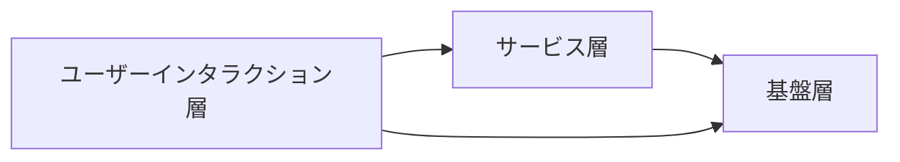
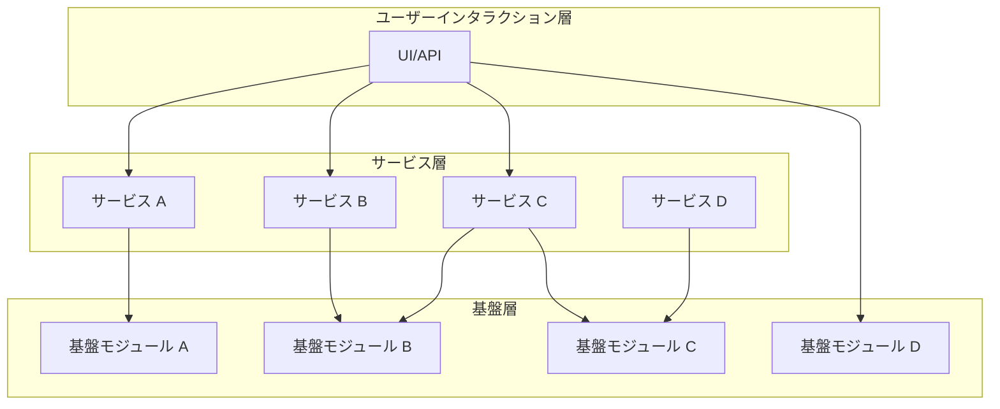
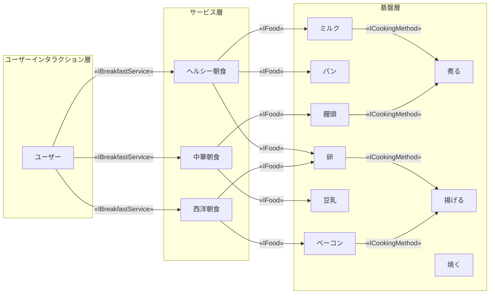
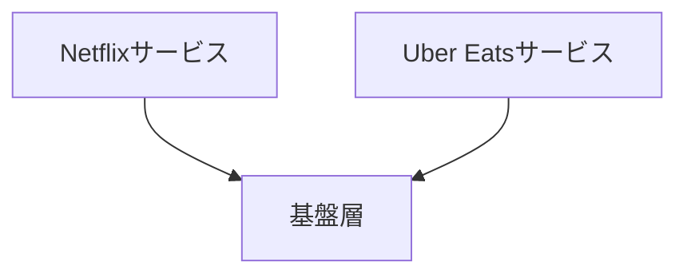
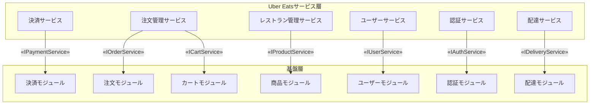
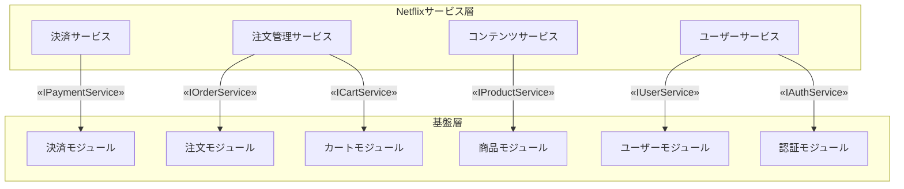

- [中文版](README.zh.md)

# モジュラー階層型アーキテクチャでスケーラブルなシステムを構築する課題



## Part 1: はじめに - スケーラブルなシステム構築

システム設計において、拡張性は非常に重要です。現在のニーズを満たすだけでなく、将来の変化に対応する能力を持たなければなりません。しかし、スケーラブルなシステムを構築する際、以下のような問題に直面します。

- モジュール間の低結合をどのように維持するか？
- 各モジュールの責任を明確にし、複雑さをどのように制御するか？

3 層モジュラーアーキテクチャを紹介し、システムの柔軟性、保守性、再利用性をどのように向上させるかを示します。

## Part 2: 課題 - コア設計の挑戦

スケーラブルなシステムを構築する際、主な設計課題は次のとおりです。

1. **拡張性と複雑性のトレードオフ**  
   システムの拡張はモジュールの独立性を保つ必要がありますが、モジュールの増加は保守の複雑化につながる可能性があります。

   **主要課題**：どのようにしてモジュールの責任を明確にし、低い結合を保てるのか？

2. **開発と保守コストのバランス**  
   再利用可能にしないと重複した開発を引き起こし、コストを増加させます。

   **主要課題**：モジュール設計を通じて、どのように重複作業を削減し、保守効率を向上させるのか？

3. **柔軟性とパフォーマンスのトレードオフ**  
   過度に柔軟な設計は複雑さを増し、逆にシンプルすぎる設計は将来的な要求に対応できない可能性があります。高い並列性を持つシナリオでは、モジュール間の通信オーバーヘッドがパフォーマンスに影響を与えることもあります。

   **主要課題**：設計の柔軟性をどのように維持し、過度な設計を避けつつ、システムパフォーマンスを担保するのか？

4. **モジュールの分離と安全性**  
    モジュール間の分離が不十分だとセキュリティ問題が発生し、1 つのモジュールの障害がシステム全体に影響を与えることがあります。

   **主要課題**：効果的な分離によって、モジュールの安全性をどのように担保するのか？

## Part 3: 解決策 - モジュラー設計と主要原則

1. **モジュールの独立性と分離性**  
   モジュラーアーキテクチャ設計により、各モジュールの機能、デプロイ、および開発を分離します。3 層アーキテクチャ設計により、モジュール間の一方向依存を保証し、結合を低減し拡張性を向上させます。

   - 機能の独立性: モジュール間はインターフェースを通じて通信し、過度の依存を避けることで、独立した開発や保守が可能となります。
   - 安全な分離: ゼロトラストアーキテクチャを使用し、モジュール間の通信を安全に保ち、モジュールの障害がシステム全体に影響を与えないようにします。

2. **コンポーネント再利用と標準化**  
   標準化されたコンポーネントライブラリを導入し、すべてのモジュールが統一された標準インターフェースに基づいて開発されることで、重複作業を削減し、モジュールの再利用性を向上させます。

   - コンポーネントライブラリ：統一されたコンポーネントライブラリは、開発効率を向上させ、作業量を削減します。
   - バージョン管理と依存関係の制御：バージョン管理と依存関係の管理により、モジュールの更新時の互換性を確保し、保守の難易度を低減します。

3. **段階的な最適化**  
   初期設計では柔軟性に重点を置き、後に非同期処理処理を用いて高い並列性を持つシナリオでの性能を徐々に最適化します。

   - 初期設計: 機能拡張の柔軟性に重点を置き、変化に迅速に対応します。
   - 性能最適化: 高並列性シナリオでは非同期処理やリソーススケジューリングを導入し、システム性能を向上させます。

4. **階層型アーキテクチャと柔軟な設計**  
   3 層アーキテクチャ（基盤層、サービス層、ユーザーインタラクション層）により、責任の分離と柔軟な拡張が保証されます。基盤層はコア機能を担当し、サービス層がビジネスロジックを実装し、ユーザーインタラクション層が外部システムとのやり取りをスムーズにします。

   - 一方向依存: 上位層は下位層のみに依存し、循環依存を避けることで保守性を向上させます。
   - 柔軟な拡張: モジュラー設計により、システム全体のアーキテクチャを変更せずに柔軟に拡張が可能となります。

## Part 4: 3 層システム設計 - 実践的な応用

この設計は、`クリーンアーキテクチャ`と`ドメイン駆動設計（DDD` の原則に基づいており、層間の一方向依存を保証しています。特定のシナリオでは（基盤層が安定したビジネスロジックを実現している場合）、ユーザーインタラクション層が直接基盤層の機能を呼び出すことで、呼び出しチェーンを短縮し、性能を向上させることが可能です。この設計は、遅延と複雑性の低減に役立ちますが、層をまたぐ呼び出しのセキュリティを考慮することが重要です。



三層アーキテクチャの概要：

1. **基盤層（Foundation Layer）**  
   主要な機能インターフェースと一部のデフォルト実装を含んでおり、ビジネスニーズに柔軟に対応する高凝集な基盤機能を提供します。簡単なシナリオでは、ユーザーインタラクション層がサービス層を介さずに基盤層の機能を直接呼び出すことができますが、その際にはセキュリティを確保する必要があります。例えば、OAuth や JWT メカニズムを使用してクロスレイヤー呼び出しの安全性を保証します。

2. **サービス層（Service Layer）**  
   サービス層は、基盤層モジュールを基にさまざまなシナリオのビジネスロジックを組み合わせ、ユーザーのニーズに応じて柔軟に調整できます。柔軟に拡張が可能です。

   サービス層は、マイクロサービスアーキテクチャを参考にして設計されており、機能モジュールの独立性を実現します。これにより、異なるチームが並行して開発および独立したデプロイを行うことができ、拡張の柔軟性も保持されます。

3. **ユーザーインタラクション層（User Interaction Layer）**  
   ユーザーインタラクション層は、ユーザーとのインターフェースを簡略化し、内部の複雑性を隠して、ユーザー操作をシンプルで効率的にします。

## Part 5: 実例とコード解説 - 朝食プランニング

複雑なシステム設計をより直感的に理解するために、以下では「モジュール化された朝食計画」を例として説明します。異なる文化やライフスタイルに合わせた朝食メニューの設計は、企業が顧客の多様なニーズに対応すると同じです。



### 1. 基盤層 - 基盤モジュール（Foundation Layer）

基盤層は、すべての基本的な食材と操作ロジックを定義します。ユーザーは手間なく、基盤層のデフォルト機能を直接呼び出すことで操作できます。例えば、新しい食材「オートミール」を追加する際には、他の部分を変更することなく、機能を追加利用できます。

```typescript
// breakfast-module

// 朝食アイテムのインターフェース定義
export interface IBreakfastItem {
  getName(): string; // 食材名を取得
  getCalories(): number; // カロリーを取得
  getCookingMethods(): ICookingMethod[]; // 調理方法を取得
  customData?: any; // 拡張可能なカスタムデータ
}

// 調理方法のインターフェース定義
export interface ICookingMethod {
  getName(): string; // 調理方法名を取得
  getDescription(): string; // 説明を取得
}

// 一般的な調理方法 - 煮る の実装
export class Boiling implements ICookingMethod {
  getName(): string {
    return "煮る";
  }

  getDescription(): string {
    return "食材を沸騰したお湯で加熱します。";
  }
}

// 一般的な調理方法 - 揚げる の実装
export class Frying implements ICookingMethod {
  getName(): string {
    return "揚げる";
  }

  getDescription(): string {
    return "食材を熱した油で調理します。";
  }
}

// 朝食サービスインターフェースの定義 - IBreakfastService
export interface IBreakfastService {
  getBreakfastItem(name: string): IBreakfastItem | undefined; // 特定の朝食アイテムを取得
  getBreakfastItems(): IBreakfastItem[]; // すべての朝食アイテムを取得
}

// デフォルトの朝食サービス実装 - DefaultBreakfastService
export class DefaultBreakfastService implements IBreakfastService {
  private repository: IBreakfastServiceRepository;

  constructor(repository: IBreakfastServiceRepository) {
    this.repository = repository;
  }

  // 特定の朝食アイテムを取得
  getBreakfastItem(name: string): IBreakfastItem | undefined {
    return this.repository.getItem(name);
  }

  // すべての朝食アイテムを取得
  getBreakfastItems(): IBreakfastItem[] {
    return this.repository.getAllItems();
  }
}

// 朝食サービスマネージャーのインターフェース定義 - IBreakfastServiceManager
export interface IBreakfastServiceManager {
  registerService(name: string, service: IBreakfastService): void; // サービスを登録
  getBreakfastItems(serviceName: string): IBreakfastItem[] | undefined; // サービスからすべての朝食アイテムを取得
  getBreakfastItem(
    serviceName: string,
    itemName: string
  ): IBreakfastItem | undefined; // サービスから特定の朝食アイテムを取得
}

// デフォルトの朝食サービスマネージャー実装 - DefaultBreakfastServiceManager
export class DefaultBreakfastServiceManager
  implements IBreakfastServiceManager
{
  private services: { [key: string]: IBreakfastService } = {};

  // サービスを登録
  registerService(name: string, service: IBreakfastService): void {
    this.services[name] = service;
  }

  // サービスからすべての朝食アイテムを取得
  getBreakfastItems(serviceName: string): IBreakfastItem[] | undefined {
    const service = this.services[serviceName];
    return service?.getBreakfastItems();
  }

  // サービスから特定の朝食アイテムを取得
  getBreakfastItem(
    serviceName: string,
    itemName: string
  ): IBreakfastItem | undefined {
    const service = this.services[serviceName];
    return service ? service.getBreakfastItem(itemName) : undefined;
  }
}

// 朝食サービスリポジトリのインターフェースを定義 - IBreakfastServiceRepository
export interface IBreakfastServiceRepository {
  getItem(name: string): IBreakfastItem | undefined; // リポジトリから単一の朝食アイテムを取得
  getAllItems(): IBreakfastItem[]; // リポジトリからすべての朝食アイテムを取得
}

// デフォルトの朝食サービスリポジトリを実装 - DefaultBreakfastServiceRepository
export class DefaultBreakfastServiceRepository
  implements IBreakfastServiceRepository
{
  private items: IBreakfastItem[] = [];

  constructor(items: IBreakfastItem[]) {
    this.items = items;
  }

  // 名前で単一の朝食アイテムを取得
  getItem(name: string): IBreakfastItem | undefined {
    return this.items.find((item) => item.getName() === name);
  }

  // すべての朝食アイテムを取得
  getAllItems(): IBreakfastItem[] {
    return this.items;
  }
}
```

### 2. サービス層 - シナリオの組み合わせモジュール（Service Layer）

サービス層は、基盤層のモジュールを組み合わせて異なる朝食サービスを提供します。例えば、ChineseService は饅頭や豆乳を提供し、WesternService はベーコンや目玉焼きを提供します。サービス層はニーズに応じて柔軟に調整でき、基盤実装には影響を与えません。

```typescript
// chinese-breakfast/index.ts
import {
  IBreakfastService,
  AbstractBreakfastItem,
  ICookingMethod,
  Boiling,
} from "breakfast-oss";

// 特定の中華料理の調理方法を実装
class StirFrying implements ICookingMethod {
  getName(): string {
    return "炒める";
  }

  getDescription(): string {
    return "少量の油でフライパンで素早く調理します。";
  }
}

// 特定の中華朝食アイテムを実装
export class ChineseBreakfastService implements IBreakfastService {
  private items: IBreakfastItem[] = [];

  constructor() {
    this.items = [
      {
        getName: () => "お粥",
        getCalories: () => 120,
        getCookingMethods: () => [new Boiling()],
      },
      {
        getName: () => "饅頭",
        getCalories: () => 200,
        getCookingMethods: () => [],
      },
      {
        getName: () => "豆乳",
        getCalories: () => 100,
        getCookingMethods: () => [],
      },
    ];
  }

  // 単一の朝食アイテムを取得
  getBreakfastItem(name: string): IBreakfastItem | undefined {
    return this.items.find((item) => item.getName() === name);
  }

  // すべての中華朝食アイテムを取得
  getBreakfastItems(): IBreakfastItem[] {
    return this.items;
  }
}

// western-breakfast/index.ts
import {
  IBreakfastService,
  AbstractBreakfastItem,
  ICookingMethod,
  Frying,
} from "breakfast-oss";

// 特定の西洋朝食アイテムを実装
export class WesternBreakfastService implements IBreakfastService {
  private items: IBreakfastItem[] = [];

  constructor() {
    this.items = [
      {
        getName: () => "目玉焼き",
        getCalories: () => 220,
        getCookingMethods: () => [new Frying()],
      },
      {
        getName: () => "ベーコン",
        getCalories: () => 250,
        getCookingMethods: () => [new Frying()],
      },
    ];
  }

  // 単一の朝食アイテムを取得
  getBreakfastItem(name: string): IBreakfastItem | undefined {
    return this.items.find((item) => item.getName() === name);
  }

  // すべての西洋朝食アイテムを取得
  getBreakfastItems(): IBreakfastItem[] {
    return this.items;
  }
}
```

### 3. ユーザーインタラクション層（User Interaction Layer） - 最終的な朝食の選択

ユーザーはロジックなどに気にせず、朝食サービスを選択するだけで、システムが関連モジュールを自動的に組み合わせ、ニーズに応じてメニューを生成します。

```typescript
// 中華朝食アイテムを取得して表示
const manager = new DefaultBreakfastServiceManager();
manager.registerService("Chinese", new ChineseBreakfastService());

const chineseBreakfast = manager.getBreakfastItems("Chinese");
chineseBreakfast?.forEach((item) => {
  console.log(
    `中華朝食 - 名前: ${item.getName()}, カロリー: ${item.getCalories()}`
  );
  item.getCookingMethods().forEach((method) => {
    console.log(`  調理方法: ${method.getName()} - ${method.getDescription()}`);
  });
});
```

```typescript
// 西洋朝食アイテムを取得して表示
const manager = new DefaultBreakfastServiceManager();
manager.registerService("Western", new WesternBreakfastService());
const westernBreakfast = manager.getBreakfastItems("Western");
westernBreakfast?.forEach((item) => {
  console.log(
    `西洋朝食 - 名前: ${item.getName()}, カロリー: ${item.getCalories()}`
  );
  item.getCookingMethods().forEach((method) => {
    console.log(`  調理方法: ${method.getName()} - ${method.getDescription()}`);
  });
});
```

## Part 6: Uber Eats と Netflix サービスの実例とコード解説 – モジュールレイヤアーキテクチャアプローチ

Uber Eats と Netflix の例を通じて、モジュール化されたアーキテクチャがどのように異なるサービスを管理し、システムの拡張性を確保するかを示します。



Netflix と Uber Eats は、基盤層で共通のロジックを共有し、モジュール化と拡張性を確保しています。

### 三層モジュラーアーキテクチャ

以下は、Uber Eats と Netflix のサービスにおける三層モジュラーアーキテクチャです。
これにより、これらのモジュールがどのように組み合わせられ、インターフェースを通じてサービス層と基盤層を接続しているかがわかります。





#### Uber Eats のサービスリスト

Uber Eats の例では、サービス層は複数のサービスに依存しており、これらのサービスを連携して提供します。

1. 支払いサービス（Payment Service）：注文の支払い、返金、ステータス更新を処理し、サードパーティの支払いゲートウェイと統合します。
2. 配送サービス（Delivery Service）：配送のスケジュール管理、配送タスクの割り当てとステータス更新、配達員のリアルタイム位置の追跡を担当します。
3. 注文管理サービス（Order Management Service）：注文の作成、更新、キャンセルを処理し、注文ステータス（処理待ち、配送中、完了など）を管理します。
4. ユーザー管理サービス（User Management Service）：購入者、販売者、配達員の登録、ログイン、および情報管理を担当し、住所と支払い情報の管理も行います。
5. レストラン管理サービス（Restaurant Management Service）：レストランの基本情報および商品の追加、更新、削除を管理します。

#### Netflix のサービスリスト

Netflix のサービス層は、以下のサービスを含んでいます。

1. ユーザーサービス（User Service）：ユーザーの登録、ログイン、情報管理および設定を担当し、ユーザー認証と認可を処理します。
2. コンテンツサービス（Content Service）：映画やテレビ番組などのコンテンツの追加、更新、削除を管理し、カテゴリ分け、検索、レコメンド機能を提供します。
3. 注文管理サービス（Order Management Service）：注文の作成、更新、キャンセルを処理し、注文ステータスを管理します。
4. 支払いサービス（Payment Service）：サブスクリプション料金の支払いと返金を担当し、支払いゲートウェイを統合して、支払いの安全性を確保します。

#### 基盤層（Foundation Layer）の概要

基盤層は、商品管理とユーザー管理の 2 つの主要な機能があります。

1. 商品管理機能

- 商品モジュール（Product Module）：商品の追加、更新、削除、在庫管理を担当します。
- 注文モジュール（Order Module）：注文の作成、更新、キャンセルを処理し、注文ステータスを管理します。
- 支払いモジュール（Payment Module）：支払いロジックを処理し、支払いステータスを追跡します。
- カートモジュール（Cart Module）：カート内の商品の追加、削除、決済を管理します。

2. ユーザー管理機能

- ユーザーモジュール（User Module）：ユーザー情報の登録、変更、および管理を処理します。
- 認証モジュール（Auth Module）：ユーザーの認証および権限管理機能を提供します。

以下は、`商品管理モジュール`のコード例です。

```typescript
// 商品モジュール: 商品の追加、更新、在庫管理を行います。
// 商品エンティティのインターフェース
export interface IProduct<CustomProps = {}> {
  id: string;
  name: string;
  price: number;
  stock: number;
  customProps?: CustomProps;
}

// 商品リポジトリのインターフェース - データ操作メソッドを提供
export interface IProductRepository<TProduct = IProduct> {
  addProduct(product: TProduct): Promise<void>;
  updateProduct(product: TProduct): Promise<void>;
  deleteProduct(productId: string): Promise<void>;
  getProductById(productId: string): Promise<TProduct | null>;
  getAllProducts(): T[];
}

export interface IProductService<TProduct = IProduct> {
  addProduct(product: TProduct): Promise<void>;
  updateProduct(product: TProduct): Promise<void>;
  deleteProduct(productId: string): Promise<void>;
  getProductById(productId: string): Promise<TProduct | null>;
  getAllProducts(): T[];
}

// 基盤層：プロダクトサービスのデフォルト実装
export class ProductService<TProduct = IProduct>
  implements IProductService<TProduct>
{
  constructor(private repository: IProductRepository<TProduct>) {}

  async addProduct(product: TProduct): Promise<void> {
    await this.repository.addProduct(product);
  }

  async updateProduct(product: TProduct): Promise<void> {
    await this.repository.updateProduct(product);
  }

  async deleteProduct(productId: string): Promise<void> {
    await this.repository.deleteProduct(productId);
  }

  async getProductById(productId: string): Promise<TProduct | null> {
    return await this.repository.getProductById(productId);
  }

  async getAllProducts(): Promise<TProduct[]> {
    return await this.repository.getAllProducts();
  }
}
```

#### サービス層（Service Layer）のカスタム実装

サービス層は、ビジネスニーズに応じて基盤層のロジックを拡張することができます。例としては、以下のカスタム実装があります。

Uber Eats のカスタム実装例：

```typescript
// Uber Eatsのカスタムプロパティ
interface UberEatsCustomProps {
  restaurantId: number;
  ownerId: number;
}

// Uber Eatsプロダクトタイプ、カスタムプロパティを拡張
export type UberEatsProduct = IProduct<UberEatsCustomProps>;

// Uber Eatsプロダクトサービス - Foundationサービスに基づいたカスタムロジック
export class UberEatsProductService {
  constructor(private productService: ProductService<UberEatsProduct>) {}

  // カスタム機能: レストランIDでメニューを取得
  async getMenuByRestaurant(restaurantId: string): Promise<UberEatsProduct[]> {
    const allProducts = await this.productService.getAllProducts();
    return allProducts.filter(
      (p) => p.customProps?.restaurantId === restaurantId
    );
  }
}
```

Netflix のカスタム実装例：

```typescript
// Netflixのカスタムプロパティ
interface NetflixCustomProps {
  releaseDate: string;
}

// Netflixプロダクトタイプ、カスタムプロパティを拡張
export type NetflixProduct = IProduct<NetflixCustomProps>;

// Netflixプロダクトサービスの実装、IProductServiceの全メソッドをオーバーライド
export class NetflixProductService implements IProductService<NetflixProduct> {
  private products: NetflixProduct[] = [];

  // プロダクト追加
  async addProduct(product: NetflixProduct): Promise<void> {
    this.products.push(product);
  }

  // プロダクト更新
  async updateProduct(product: NetflixProduct): Promise<void> {
    const index = this.products.findIndex((p) => p.id === product.id);
    if (index !== -1) {
      this.products[index] = product;
    }
  }

  // プロダクト削除
  async deleteProduct(productId: string): Promise<void> {
    this.products = this.products.filter((product) => product.id !== productId);
  }

  // プロダクトをIDで取得
  async getProductById(productId: string): Promise<NetflixProduct | null> {
    return this.products.find((product) => product.id === productId) || null;
  }

  // 全プロダクトを取得
  async getAllProducts(): Promise<NetflixProduct[]> {
    return this.products;
  }

  // Netflix独自のロジック: リリース日でプロダクトをソート
  async sortByReleaseDate(): Promise<NetflixProduct[]> {
    return this.products.sort(
      (a, b) =>
        new Date(a.customProps?.releaseDate).getTime() -
        new Date(b.customProps?.releaseDate).getTime()
    );
  }
}
```

## Part 7: 重要な設計原則 - SOLID と DDD

モジュール化設計では、SOLID 原則およびドメイン駆動設計（DDD）を従うことで、コードの保守性、拡張性、柔軟性が大幅に向上します。上記のコードでこれらの設計原則を説明します。

### SOLID 原則の適用

1. 単一責任原則 (SRP)：  
   朝食プランニングの例では、各モジュール（例: IBreakfastService、IBreakfastServiceRepository）は明確な責任を担っています。IBreakfastService は朝食アイテムの提供を担当し、IBreakfastServiceRepository はデータアクセスロジックに専念しています。このような分割により、モジュールの変更が他の部分に影響を与えず、コードの保守性が向上しています。

2. 開放-閉鎖原則 (OCP)：  
   朝食サービス層では、「和風朝食」や「洋風朝食」などの新しい朝食タイプを IBreakfastService インターフェースを使って拡張して実装できます。既存のコードを変更せずにシステムを拡張できるため、この設計によりコアロジックを変更せずに拡張が可能となります。

3. リスコフの置換原則 (LSP)：  
   Uber Eats や Netflix の例では、IProductService を実装したクラスはシステムに影響を与えずに置き換できます。これにより、ビジネス要件に応じて異なる製品サービス実装を簡単に置き換えたり拡張したりできます。

4. インターフェース分離原則 (ISP)：  
   異なるサービスインターフェースを分離することで（例えば、IPaymentService と IOrderService）、各サービスは自分に関連する機能のみを実装すればよく、不要な機能の実装を避けられます。この設計により、不要な依存関係が減り、システムがより明確で理解しやすく、実装も簡単になります。

5. 存性逆転の原則 (DIP)：  
   クラスは具体的な実装ではなく抽象インターフェースに依存しており、たとえば DefaultBreakfastService は IBreakfastServiceRepository インターフェースに依存しています。これにより、異なるリポジトリの実装を依存性注入を通じて簡単に入れ替えることができ、システムの柔軟性が向上します。

#### DDD の適用

1. ドメインモデル:  
   朝食プランニングや Uber Eats と Netflix の例では、基礎層はそれぞれのドメインオブジェクト（IBreakfastItem や IProduct など）を定義しており、これらのオブジェクトはビジネスルールと要件を反映しています。これにより、システムの機能が堅牢で、一貫したドメインロジックが維持されます。

2. アグリゲートルート:  
   Uber Eats や Netflix の例では、IProductService は商品および関連情報を管理するためのコアインターフェースです。これが商品の集約ルートとして機能し、商品に対するすべての操作が既定のビジネスルールに従うことを保証し、データの不整合を防ぎます。

3. 境界づけられたコンテキスト  
   Uber Eats や Netflix の各サービスは、明確なコンテキスト境界によってビジネスロジックが分離されており、サービス間のロジックが干渉しないように設計されています。この設計により、各サービスの拡張が容易になります。

4. リポジトリパターン:  
   IBreakfastServiceRepository や IProductRepository などのインターフェースは、データソースとのやり取りを抽象化し、ドメインモデルとデータアクセスロジックを分離します。この設計により、必要に応じてデータアクセス層の実装を容易に差し替えられ、ドメインロジックに影響を与えることはありません。

## Part 8: 拡張性と柔軟性

### 比較例: 非モジュール設計 vs. モジュール設計

**シナリオ 1：JapaneseBreakfastService の追加**
要件: ご飯と味噌汁を組み合わせた `JapaneseBreakfastService`クラスを実装する。

1. **非モジュール設計実装**  
   モジュール化されていない設計では、すべての食材とロジックが一つのクラスに混在しています。新しい和風朝食オプション（例: 寿司）を追加する場合、既存の `getBreakfast` 関数を変更しなといけない、これにより結合度が高くなり、コードが複雑で保守が難しくなります。

```typescript
// 非モジュール化設計
class BreakfastService {
  getBreakfast(type: string) {
    if (type === "Japanese") {
      return "ご飯 + 味噌汁";
    } else if (type === "American") {
      return "卵焼き + トースト";
    }
    return "不明な朝食タイプ";
  }
}

const service = new BreakfastService();
console.log(service.getBreakfast("Japanese")); // 出力: ご飯 + 味噌汁
```

2. **モジュール化設計の実装**  
   モジュール化された設計では、既存の独立したモジュールを組み合わせることで新しい機能を実現します。JapaneseBreakfastService は JapaneseRice や MisoSoup モジュールを組み合わせることで簡単に和風朝食を生成できます。

```typescript
// 一般的な朝食モジュールインターフェースを定義
interface IBreakfastItem {
  getName(): string;
  getCalories(): number;
}

// 具体的な食品モジュールを実装
class JapaneseRice implements IBreakfastItem {
  getName() {
    return "ご飯";
  }
  getCalories() {
    return 300;
  }
}

class MisoSoup implements IBreakfastItem {
  getName() {
    return "味噌汁";
  }
  getCalories() {
    return 100;
  }
}

// 日式朝食を組み合わせるサービスクラスを実装
class JapaneseBreakfastService {
  private items: IBreakfastItem[];

  constructor() {
    this.items = [new JapaneseRice(), new MisoSoup()]; // 日式朝食の組み合わせ
  }

  getBreakfast() {
    return this.items.map((item) => item.getName()).join(" + ");
  }
}

// 使用例:
const japaneseService = new JapaneseBreakfastService();
console.log(japaneseService.getBreakfast()); // 出力: ご飯 + 味噌汁
```

---

**シナリオ 2： カスタマイズ機能**  
要件: ユーザーが動的に異なる食材モジュールを選択して自分の朝食を作成できるようにする。

1. **非モジュール設計実装**  
   モジュール化されていない設計では、ユーザー定義オプションはハードコーディングで処理する必要があり、柔軟性が低く、メンテナンスコストが高くなります。

```typescript
// モジュール化されていないユーザー定義機能
class BreakfastService {
  getCustomBreakfast(items: string[]) {
    let breakfast = "";

    if (items.includes("ご飯")) {
      breakfast += "ご飯";
    }
    if (items.includes("味噌汁")) {
      breakfast += (breakfast ? " + " : "") + "味噌汁";
    }
    if (items.includes("卵焼き")) {
      breakfast += (breakfast ? " + " : "") + "卵焼き";
    }
    if (items.includes("トースト")) {
      breakfast += (breakfast ? " + " : "") + "トースト";
    }

    return breakfast || "選択された食べ物がありません";
  }
}

// 使用例:
const service = new BreakfastService();
console.log(service.getCustomBreakfast(["ご飯", "卵焼き"])); // 出力: ご飯 + 卵焼き
```

2. **モジュール設計の実装**  
   モジュール化された設計では、ユーザーが動的に食材モジュールを選択して自分の朝食を作成できるため、コアサービスを変更する必要がありません。拡張性と柔軟性が大幅に向上します。

```typescript
// 一般的な朝食モジュールインターフェースを定義
interface IBreakfastItem {} // 上記と同様、省略

// 具体的な食品モジュールを実装
class JapaneseRice implements IBreakfastItem {
  getName() {
    return "ご飯";
  }
  getCalories() {
    return 300;
  }
}

class MisoSoup implements IBreakfastItem {
  getName() {
    return "味噌汁";
  }
  getCalories() {
    return 100;
  }
}

class Egg implements IBreakfastItem {
  getName() {
    return "卵焼き";
  }
  getCalories() {
    return 200;
  }
}

class Toast implements IBreakfastItem {
  getName() {
    return "トースト";
  }
  getCalories() {
    return 150;
  }
}

// ユーザーのカスタマイズ機能を提供するサービスを定義
class CustomBreakfastService {
  private availableItems: IBreakfastItem[];

  constructor() {
    // ユーザーに提供する選択肢として、利用可能な食品モジュールを提供
    this.availableItems = [
      new JapaneseRice(),
      new MisoSoup(),
      new Egg(),
      new Toast(),
    ];
  }

  getAvailableItems(): IBreakfastItem[] {
    return this.availableItems;
  }

  createCustomBreakfast(selectedItems: IBreakfastItem[]) {
    return (
      selectedItems.map((item) => item.getName()).join(" + ") ||
      "選択された食べ物がありません"
    );
  }
}

// 使用例:
const customService = new CustomBreakfastService();
const userSelection = [new JapaneseRice(), new Egg()]; // ユーザー選択の食品
console.log(customService.createCustomBreakfast(userSelection)); // 出力: ご飯 + 卵焼き
```

#### 結論

モジュール化設計は、システムの拡張性、柔軟性、および保守性を大幅に向上させることができます。モジュール化されていない設計と比較して、モジュール化アーキテクチャは複雑な要件をより効果的に対応し、技術的負債を減らし、ビジネスの長期的な発展をサポートします。

## Part 9: まとめ

この設計により、現在のニーズを解決するだけでなく、システムの長期的な進化の基盤を築きました。このアーキテクチャは、以下の重要な利点をもたらします：

1. 開発効率の向上
   チームは各自のモジュールに専念でき、開発時の依存や干渉が減少します。

2. システムの保守性向上
   標準化されたインターフェースにより、新機能の統合が容易になり、長期的な保守コストが削減され、技術的負債が抑えられます。

3. 技術の進化とシステム移行のサポート

   モジュール化設計により、既存の構造を崩すことなく、徐々に置き換えや最適化ができ、技術更新や移行がスムーズに進行し、システムの置き換えや最適化に伴うコストとリスクが軽減されます

4. ビジネス成長への対応
   システムはビジネスの成長と要件の変化に応じて段階的に最適化でき、技術的負債の急速な蓄積を回避し、市場の変化に柔軟に対応できます。

技術的な決定は、全般的にパフォーマンス、拡張性、柔軟性、安全性のバランスを考慮しており、モジュール化アーキテクチャはシステムの長期的な安定性と拡張性を担保します。
