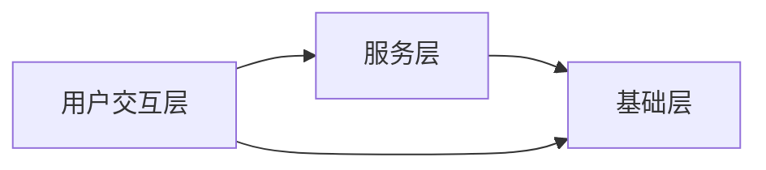
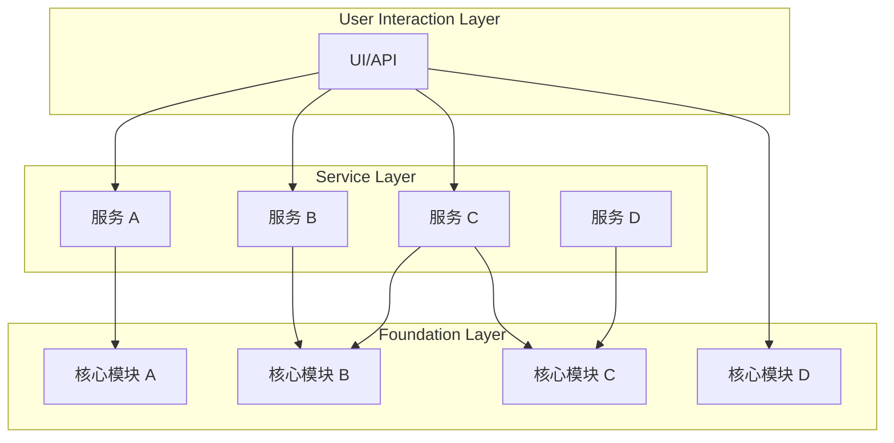
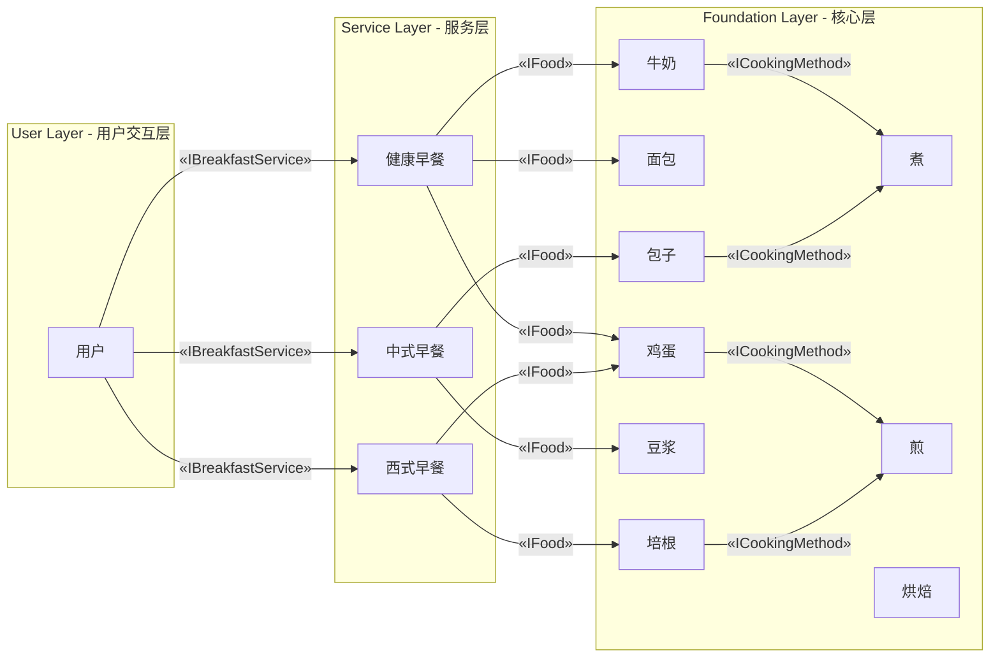
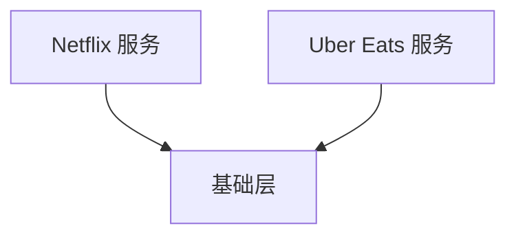
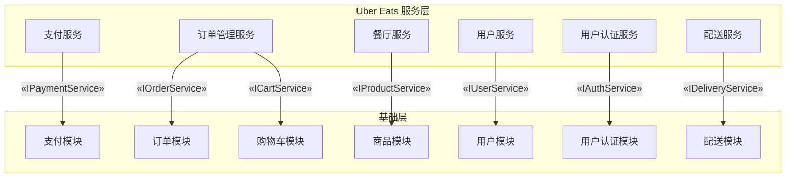
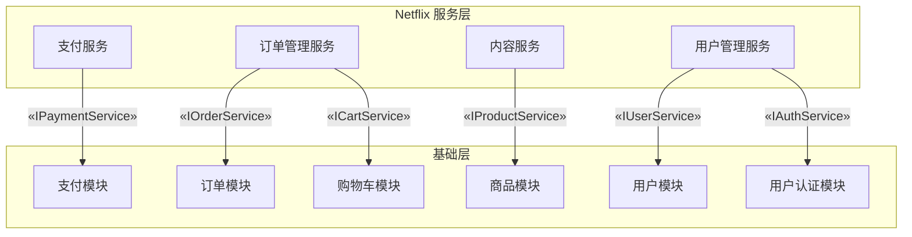

# Challenge of Building a Scalable System with Modular Layered Architecture



## Part 1: Introduction - The Challenge of Building a Scalable System

系统设计中，扩展性尤为重要，不仅要满足当前需求，还要适应未来变化。然而，在构建可扩展系统时，我们常面临以下问题：

- 如何在模块之间保持低耦合？
- 如何控制复杂度的同时，明确各模块职责？

本篇将介绍一种三层模块化架构，展示如何提升系统的灵活性、可维护性和重用性。

## Part 2: Problem - Core Design Challenges

在构建可扩展系统时，主要设计挑战有：

1. **扩展性与复杂性管理的矛盾**  
   系统扩展需保持模块独立，但模块增加可能导致维护复杂化。

   **核心问题**：如何确保模块职责明确并保持低耦合？

2. **开发与维护成本的平衡**  
   缺乏复用机制容易导致重复开发，增加成本。

   **核心问题**：如何通过模块化设计减少重复工作，提高维护效率？

3. **灵活性与性能的权衡**  
   过于灵活的设计可能增加复杂性，过于简单的设计可能无法应对未来需求。在高并发场景下，模块通信开销也可能影响性能。

   **核心问题**：如何在确保灵活性的同时，避免过度设计并保证性能？

4. **模块隔离与安全性**  
    模块之间的隔离不足可能导致安全问题，某个模块的故障可能影响整个系统。

   **核心问题**：如何通过有效的隔离确保模块的安全性？

## Part 3: Solution - Modular Design and Key Principles

1. **模块独立性与隔离性**  
   通过模块化架构设计，实现各模块功能、部署和开发的解耦。使用三层架构设计确保模块间的单向依赖，减少耦合并提升扩展性。

   - 功能独立：模块之间通过接口通信，避免过度依赖，便于独立开发与维护。
   - 安全隔离：通过零信任架构，确保模块间通信安全，模块故障不会影响全局。

2. **组件复用与标准化**  
   引入标准化的组件库，所有模块都基于统一的标准接口开发，减少重复工作，提升模块复用性。

   - 组件库：统一的组件库提升开发效率并减少工作量。
   - 版本管理与依赖控制：通过版本控制和依赖管理机制，确保模块更新时的兼容性，降低维护难度。

3. **渐进式优化**  
   初期设计以灵活性为主，后期通过异步处理机制逐步优化性能，特别是高并发场景下的优化。

   - 初期设计：注重功能扩展的灵活性，快速响应变化。
   - 性能优化：高并发场景下引入异步处理和资源调度机制，提升系统性能。

4. **分层架构与灵活设计**
   三层架构（核心层、服务层、用户交互层）确保了职责分离与灵活扩展。核心层负责核心功能，服务层实现业务逻辑，用户交互层简化与外部系统的交互。

   - 单向依赖：上层只依赖下层，避免循环依赖，提升可维护性。
   - 灵活扩展：模块化设计使系统能够在不改变整体架构的情况下灵活扩展。

## Part 4: Three-Layer System Design - Practical Application

该设计基于`清洁架构`和`领域驱动设计（DDD`的原则，确保层级间的单向依赖。在某些场景下（核心层已经实现了完整且稳定的业务逻辑），用户交互层可以直接调用基础层功能，以减少调用链并提升性能。这种设计有助于降低延迟与复杂性，但要注意确保跨层调用的安全性。



三层架构解析：

1. **核心层（Foundation Layer）**
   核心层包含核心功能接口和部分默认实现，提供高内聚的基础功能，灵活应对业务需求。简单场景下，用户交互层可以绕过服务层，直接调用核心层功能，但要确保安全性，例如通过 OAuth 或 JWT 机制来保证跨层调用的安全。

2. **服务层（Service Layer）**
   服务层基于核心模块组合不同场景的业务逻辑，支持灵活调整以满足用户需求。使系统易于扩展。

   服务层设计参考微服务架构，旨在实现功能模块的独立性，支持不同团队的并行开发与独立部署。同时保持扩展灵活性。

3. **用户交互层（User Interaction Layer）**
   用户交互层通过简化接口与用户交互，隐藏内部复杂性，确保用户操作简便高效。

## Part 5: Real-Life Example and Code Walkthrough - Modular Breakfast Planning

为更直观理解复杂系统设计，以下是“模块化早餐计划”来说明。根据不同文化和生活方式设计早餐菜单，类似于企业如何满足客户多样化需求。



### 1. 核心层 - 基础模块（Foundation Layer）

核心层定义了所有基础食材和操作逻辑。用户可以直接调用核心层的默认功能，减少复杂步骤。比如增加新食材“燕麦片”，不需要修改其他部分即可复用该功能。

```typescript
// breakfast-module

// 定义早餐项目接口
export interface IBreakfastItem {
  getName(): string; // 获取食物名称
  getCalories(): number; // 获取食物的卡路里
  getCookingMethods(): ICookingMethod[]; // 获取烹饪方法
  customData?: any; // 可扩展的自定义数据
}

// 定义烹饪方法接口
export interface ICookingMethod {
  getName(): string; // 获取烹饪方法名称
  getDescription(): string; // 获取烹饪方法描述
}

// 实现通用的烹饪方法 - 煮
export class Boiling implements ICookingMethod {
  getName(): string {
    return "煮";
  }

  getDescription(): string {
    return "将食物放入水中加热至沸腾。";
  }
}

// 实现通用的烹饪方法 - 煎
export class Frying implements ICookingMethod {
  getName(): string {
    return "煎";
  }

  getDescription(): string {
    return "在热油中烹饪食物。";
  }
}

// 定义早餐服务接口 - IBreakfastService
export interface IBreakfastService {
  getBreakfastItem(name: string): IBreakfastItem | undefined; // 获取单个早餐项目
  getBreakfastItems(): IBreakfastItem[]; // 获取所有早餐项目
}

// 定义默认早餐服务实现 - DefaultBreakfastService
export class DefaultBreakfastService implements IBreakfastService {
  private repository: IBreakfastServiceRepository;

  constructor(repository: IBreakfastServiceRepository) {
    this.repository = repository;
  }

  // 获取单个早餐项目
  getBreakfastItem(name: string): IBreakfastItem | undefined {
    return this.repository.getItem(name);
  }

  // 获取所有早餐项目
  getBreakfastItems(): IBreakfastItem[] {
    return this.repository.getAllItems();
  }
}

// 定义早餐服务管理器接口 - IBreakfastServiceManager
export interface IBreakfastServiceManager {
  registerService(name: string, service: IBreakfastService): void; // 注册服务
  getBreakfastItems(serviceName: string): IBreakfastItem[] | undefined; // 获取服务下的所有早餐项目
  getBreakfastItem(
    serviceName: string,
    itemName: string
  ): IBreakfastItem | undefined; // 获取服务下的单个早餐项目
}

// 默认实现 - DefaultBreakfastServiceManager
export class DefaultBreakfastServiceManager
  implements IBreakfastServiceManager
{
  private services: { [key: string]: IBreakfastService } = {};

  // 注册服务
  registerService(name: string, service: IBreakfastService): void {
    this.services[name] = service;
  }

  // 获取某个服务下的所有早餐项目
  getBreakfastItems(serviceName: string): IBreakfastItem[] | undefined {
    const service = this.services[serviceName];
    return service ? service.getBreakfastItems() : undefined;
  }

  // 获取某个服务下的单个早餐项目
  getBreakfastItem(
    serviceName: string,
    itemName: string
  ): IBreakfastItem | undefined {
    const service = this.services[serviceName];
    return service ? service.getBreakfastItem(itemName) : undefined;
  }
}

// 定义早餐服务仓库接口 - IBreakfastServiceRepository
export interface IBreakfastServiceRepository {
  getItem(name: string): IBreakfastItem | undefined; // 从仓库获取单个早餐项目
  getAllItems(): IBreakfastItem[]; // 从仓库获取所有早餐项目
}

// 定义默认早餐服务仓库实现 - DefaultBreakfastServiceRepository
export class DefaultBreakfastServiceRepository
  implements IBreakfastServiceRepository
{
  private items: IBreakfastItem[] = [];

  constructor(items: IBreakfastItem[]) {
    this.items = items;
  }

  // 根据名称获取单个早餐项目
  getItem(name: string): IBreakfastItem | undefined {
    return this.items.find((item) => item.getName() === name);
  }

  // 获取所有早餐项目
  getAllItems(): IBreakfastItem[] {
    return this.items;
  }
}
```

### 2. 服务层 - 场景组合模块（Service Layer）

服务层将核心模块组合成不同的早餐服务，例如 ChineseService 提供包子和豆浆，WesternService 提供培根和煎蛋。服务层可根据需求灵活调整，不影响底层实现。

```typescript
// chinese-breakfast/index.ts
import {
  IBreakfastService,
  AbstractBreakfastItem,
  ICookingMethod,
  Boiling,
} from "breakfast-oss";

// 特定的中餐烹饪方法实现
class StirFrying implements ICookingMethod {
  getName(): string {
    return "炒";
  }

  getDescription(): string {
    return "在锅中用少量油快速烹饪食物。";
  }
}

// 实现具体的中餐早餐项目
export class ChineseBreakfastService implements IBreakfastService {
  private items: IBreakfastItem[] = [];

  constructor() {
    this.items = [
      {
        getName: () => "粥",
        getCalories: () => 120,
        getCookingMethods: () => [new Boiling()],
      },
      {
        getName: () => "包子",
        getCalories: () => 200,
        getCookingMethods: () => [],
      },
      {
        getName: () => "豆浆",
        getCalories: () => 100,
        getCookingMethods: () => [],
      },
    ];
  }

  // 获取单个早餐项目
  getBreakfastItem(name: string): IBreakfastItem | undefined {
    return this.items.find((item) => item.getName() === name);
  }

  // 获取所有中餐早餐项目
  getBreakfastItems(): IBreakfastItem[] {
    return this.items;
  }
}

// western-breakfast/index.ts
import {
  IBreakfastService,
  AbstractBreakfastItem,
  ICookingMethod,
  Frying,
} from "breakfast-oss";

// 实现具体的西餐早餐项目
export class WesternBreakfastService implements IBreakfastService {
  private items: IBreakfastItem[] = [];

  constructor() {
    this.items = [
      {
        getName: () => "煎蛋",
        getCalories: () => 220,
        getCookingMethods: () => [new Frying()],
      },
      {
        getName: () => "培根",
        getCalories: () => 250,
        getCookingMethods: () => [new Frying()],
      },
    ];
  }

  // 获取单个早餐项目
  getBreakfastItem(name: string): IBreakfastItem | undefined {
    return this.items.find((item) => item.getName() === name);
  }

  // 获取所有西餐早餐项目
  getBreakfastItems(): IBreakfastItem[] {
    return this.items;
  }
}
```

### 3. 用户交互层（User Interaction Layer） - 最终早餐选择

用户无需关心背后逻辑,只需选择早餐服务，系统自动组合相关模块，生成对应菜单。

```typescript
// 获取并显示中餐早餐项目
const manager = new DefaultBreakfastServiceManager();
manager.registerService("Chinese", new ChineseBreakfastService());

const chineseBreakfast = manager.getBreakfastItems("Chinese");
chineseBreakfast?.forEach((item) => {
  console.log(
    `Chinese Breakfast - Name: ${item.getName()}, Calories: ${item.getCalories()}`
  );
  item.getCookingMethods().forEach((method) => {
    console.log(
      `  Cooking Method: ${method.getName()} - ${method.getDescription()}`
    );
  });
});
```

```typescript
// 获取并显示西餐早餐项目
const manager = new DefaultBreakfastServiceManager();
manager.registerService("Western", new WesternBreakfastService());
const westernBreakfast = manager.getBreakfastItems("Western");
westernBreakfast?.forEach((item) => {
  console.log(
    `Western Breakfast - Name: ${item.getName()}, Calories: ${item.getCalories()}`
  );
  item.getCookingMethods().forEach((method) => {
    console.log(
      `  Cooking Method: ${method.getName()} - ${method.getDescription()}`
    );
  });
});
```

## Part 6: Uber Eats and Netflix Services Example and Code Walkthrough – Modular Layered Architecture Approach

通过 Uber Eats 和 Netflix 的例子，展示如何通过模块化架构管理不同服务，确保系统的扩展性。



Netflix 和 Uber Eats 通过基础层共享通用逻辑，确保了模块化和可扩展性。

### 三层模块架构

以下是 Uber Eats 和 Netflix 服务的三层模块架构，它们展示了如何组织这些模块，并通过接口将服务层与基础层连接起来。





#### Uber Eats 服务列表

以 Uber Eats 为例，服务层依赖多个服务，这些服务配合完成业务逻辑：

1. 支付服务 (Payment Service)：处理订单支付、退款和状态更新，集成第三方支付网关。
2. 配送服务 (Delivery Service)：负责配送调度，管理配送任务分配和状态更新，跟踪配送员实时位置。
3. 订单管理服务 (Order Management Service)：处理订单的创建、更新、取消，并管理订单状态（如待处理、配送中、已完成等）。
4. 用户管理服务 (User Management Service)：管理买家、卖家和配送员的注册、登录及信息管理，包含地址和支付信息管理。
5. 餐厅管理服务 (Restaurant Management Service)：管理餐厅的基本信息及商品的添加、更新和删除。

#### Netflix 服务列表

Netflix 的服务层设计包括以下服务

1. 用户服务 (User Service)：负责用户注册、登录、信息管理和偏好设置，处理用户认证和授权。
2. 内容服务 (Content Service)：管理电影、电视剧和其他内容的添加、更新、删除，提供分类、搜索和推荐功能。
3. 订单管理服务 (Order Management Service)：处理订单的创建、更新、取消，管理订单状态。
4. 支付服务 (Payment Service)：负责订阅费用支付与退款，集成支付网关，确保支付安全性。

#### 核心层（Foundation Layer）详解

基础层的核心模块包括产品管理和用户管理两个领域：

1. 产品管理功能

- 商品模块（Product Module）：管理商品的添加、更新、删除和库存控制。
- 订单模块（Order Module）：处理订单的创建、更新、取消，并管理订单状态。
- 支付模块（Payment Module）：处理支付逻辑，跟踪支付状态。
- 购物车模块（Cart Module）：管理购物车中商品的添加、删除和结算。

2. 用户管理功能

- 用户模块（User Module）：处理用户信息的注册、修改和管理。
- 用户认证模块（Auth Module）：提供用户身份认证和权限管理功能。

以下是`产品管理模块`的代码示例：

```typescript
// 商品模块：管理商品的添加、更新、库存控制。
// 商品实体接口
export interface IProduct<CustomProps = {}> {
  id: string;
  name: string;
  price: number;
  stock: number;
  customProps?: CustomProps;
}

// 商品仓储接口 - 提供数据操作方法
export interface IProductRepository<TProduct = IProduct> {
  addProduct(product: TProduct): Promise<void>;
  updateProduct(product: TProduct): Promise<void>;
  deleteProduct(productId: string): Promise<void>;
  getProductById(productId: string): Promise<TProduct | null>;
  getAllProducts(): T[];
}

export interface IProductService<TProduct = IProduct> {
  addProduct(product: TProduct): Promise<void>;
  updateProduct(product: TProduct): Promise<void>;
  deleteProduct(productId: string): Promise<void>;
  getProductById(productId: string): Promise<TProduct | null>;
  getAllProducts(): T[];
}

// 核心层：商品服务默认实现 - 使用仓储进行数据管理
export class ProductService<TProduct = IProduct>
  implements IProductService<TProduct>
{
  constructor(private repository: IProductRepository<TProduct>) {}

  async addProduct(product: TProduct): Promise<void> {
    await this.repository.addProduct(product);
  }

  async updateProduct(product: TProduct): Promise<void> {
    await this.repository.updateProduct(product);
  }

  async deleteProduct(productId: string): Promise<void> {
    await this.repository.deleteProduct(productId);
  }

  async getProductById(productId: string): Promise<TProduct | null> {
    return await this.repository.getProductById(productId);
  }

  async getAllProducts(): Promise<TProduct[]> {
    return await this.repository.getAllProducts();
  }
}
```

#### 服务层（Service Layer）定制实现

服务层可以根据业务需求扩展基础层逻辑。例如：

Uber Eats 自定义实现示例：

```typescript
// Uber Eats 专属的自定义属性
interface UberEatsCustomProps {
  restaurantId: number;
  ownerId: number;
}

// Uber Eats 产品类型，使用泛型扩展自定义属性
export type UberEatsProduct = IProduct<UberEatsCustomProps>;

// Uber Eats 产品服务 - 通过组合基础服务实现自定义逻辑
export class UberEatsProductService {
  constructor(private productService: ProductService<UberEatsProduct>) {}

  // 扩展自定义功能：按餐厅ID获取菜单
  async getMenuByRestaurant(restaurantId: string): Promise<UberEatsProduct[]> {
    const allProducts = await this.productService.getAllProducts();
    return allProducts.filter(
      (p) => p.customProps?.restaurantId === restaurantId
    );
  }
}
```

Netflix 自定义实现示例：

```typescript
// Netflix 专属的自定义属性
interface NetflixCustomProps {
  releaseDate: string;
}

// Netflix 产品类型，使用泛型扩展自定义属性
export type NetflixProduct = IProduct<NetflixCustomProps>;

// Netflix 产品服务的具体实现，重写 IProductService 的所有方法
export class NetflixProductService implements IProductService<NetflixProduct> {
  private products: NetflixProduct[] = [];

  // 添加产品
  async addProduct(product: NetflixProduct): Promise<void> {
    this.products.push(product);
  }

  // 更新产品
  async updateProduct(product: NetflixProduct): Promise<void> {
    const index = this.products.findIndex((p) => p.id === product.id);
    if (index !== -1) {
      this.products[index] = product;
    }
  }

  // 删除产品
  async deleteProduct(productId: string): Promise<void> {
    this.products = this.products.filter((product) => product.id !== productId);
  }

  // 通过ID获取产品
  async getProductById(productId: string): Promise<NetflixProduct | null> {
    return this.products.find((product) => product.id === productId) || null;
  }

  // 获取所有产品
  async getAllProducts(): Promise<NetflixProduct[]> {
    return this.products;
  }

  // Netflix 特有的逻辑：按发布日期排序产品
  async sortByReleaseDate(): Promise<NetflixProduct[]> {
    return this.products.sort(
      (a, b) =>
        new Date(a.customProps?.releaseDate).getTime() -
        new Date(b.customProps?.releaseDate).getTime()
    );
  }
}
```

## Part 7: Key Design Principles - SOLID and DDD

在模块化设计中，遵循 SOLID 原则和领域驱动设计（DDD）可以大幅提升代码的可维护性、可扩展性和灵活性。以下将使用上述代码来解释这些设计原则。

### SOLID 原则的应用

1. 单一职责原则 (SRP)：
   在早餐规划示例中，每个模块（如 IBreakfastService、IBreakfastServiceRepository）都承担了明确的职责。IBreakfastService 负责提供早餐项目，而 IBreakfastServiceRepository 则专注于数据访问逻辑。这样的划分确保了模块的变化不会影响其他部分，提升了代码的可维护性。

2. 开放-封闭原则 (OCP)：
   在早餐服务层，新的早餐类型（如“西式早餐”或“中式早餐”）可以通过扩展 IBreakfastService 接口来实现，而无需修改现有的代码。这种设计使得系统可以在不修改核心逻辑的情况下进行扩展。

3. 里氏替换原则 (LSP)：
   在 Uber Eats 和 Netflix 的框架中，任何实现了 IProductService 的类都可以无缝替换，而不会影响系统的正常运作。这可以让我们根据业务需求轻松替换或扩展不同的产品服务实现。

4. 接口分隔原则 (ISP)：
   通过将不同的服务接口分离（如 IPaymentService 和 IOrderService），每个服务只需要实现与自己相关的功能，避免了实现不必要的功能。这种设计减少了不必要的依赖，使系统更清晰、更易于理解和实现。

5. 依赖反转原则 (DIP)：
   类大多依赖于抽象接口而非具体实现，例如 DefaultBreakfastService 依赖于 IBreakfastServiceRepository 接口，通过这种方式，可以通过依赖注入轻松替换不同的存储库实现，从而提高系统的灵活性。

#### DDD 的应用

1. 领域模型：
   在早餐规划和在 Uber Eats 和 Netflix 框架中，核心层定义了各个领域对象（如 IBreakfastItem、IProduct），这些对象反映了业务规则与需求，确保系统功能的健壮性和领域一致性。

2. 聚合根：
   在 Uber Eats 和 Netflix 框架中，IProductService 是负责管理产品及相关信息的核心接口。它作为产品的聚合根，确保所有对产品的操作都遵循既定的业务规则，避免了数据的不一致。

3. 限界上下文：
   各个服务（如 Uber Eats 和 Netflix）的业务逻辑通过清晰的上下文边界进行隔离，使得每个服务的逻辑互不干扰，易于扩展。

4. 仓储模式：
   IBreakfastServiceRepository 和 IProductRepository 等接口提供了数据访问的抽象层，确保了领域逻辑与数据访问逻辑的分离。这样设计使得在未来轻松替换数据访问层而不影响核心业务逻辑。

## Part 8: Scalability and Flexibility

### 示例对比：无模块化设计 vs. 使用模块化设计

**场景 1：增加 JapaneseBreakfastService**
要求：实现一个服务类 JapaneseBreakfastService，组合米饭和味噌汤，生成日式早餐。

1. **无模块化设计的实现**  
   在没有模块化设计的情况下，所有的食物和逻辑都混合在一个类中。
   如果要新增更多日式早餐选项（如寿司），需修改现有代码`getBreakfast`函数，耦合度高，代码会变得臃肿、难以维护。

```typescript
// 没有模块化设计的服务
class BreakfastService {
  getBreakfast(type: string) {
    if (type === "Japanese") {
      return "米饭 + 味噌汤";
    } else if (type === "American") {
      return "煎蛋 + 吐司";
    }
    // 如果要新增更多早餐类型，必须修改此类
    return "未知早餐类型";
  }
}

// 使用时：
const service = new BreakfastService();
console.log(service.getBreakfast("Japanese")); // 输出：米饭 + 味噌汤
```

2. **使用模块化设计的实现**  
   在模块化设计中, 通过组合已有的独立模块来实现新的功能，扩展性更强。JapaneseBreakfastService 可以通过组合 JapaneseRice 和 MisoSoup 模块轻松生成日式早餐。

```typescript
// 定义通用的早餐模块接口
interface IBreakfastItem {
  getName(): string;
  getCalories(): number;
}

// 实现具体的食物模块
class JapaneseRice implements IBreakfastItem {
  getName() {
    return "米饭";
  }
  getCalories() {
    return 300;
  }
}

class MisoSoup implements IBreakfastItem {
  getName() {
    return "味噌汤";
  }
  getCalories() {
    return 100;
  }
}

// 实现组合日式早餐的服务类
class JapaneseBreakfastService {
  private items: IBreakfastItem[];

  constructor() {
    this.items = [new JapaneseRice(), new MisoSoup()]; // 日式早餐的组合
  }

  getBreakfast() {
    return this.items.map((item) => item.getName()).join(" + ");
  }
}

// 使用时：
const japaneseService = new JapaneseBreakfastService();
console.log(japaneseService.getBreakfast()); // 输出：米饭 + 味噌汤
```

---

**场景 2：用户自定义功能**  
要求：允许用户动态选择不同的食物模块，生成属于他们的早餐。

1. **无模块化设计的实现**  
   在没有模块化设计的情况下，用户自定义选项必须通过硬编码处理，灵活性差，维护成本高。

```typescript
// 没有模块化设计的用户自定义功能
class BreakfastService {
  getCustomBreakfast(items: string[]) {
    let breakfast = "";

    if (items.includes("米饭")) {
      breakfast += "米饭";
    }
    if (items.includes("味噌汤")) {
      breakfast += (breakfast ? " + " : "") + "味噌汤";
    }
    if (items.includes("煎蛋")) {
      breakfast += (breakfast ? " + " : "") + "煎蛋";
    }
    if (items.includes("吐司")) {
      breakfast += (breakfast ? " + " : "") + "吐司";
    }

    return breakfast || "没有选择任何食物";
  }
}

// 使用时：
const service = new BreakfastService();
console.log(service.getCustomBreakfast(["米饭", "煎蛋"])); // 输出：米饭 + 煎蛋
```

2. **使用模块化设计的实现**  
   模块化设计允许用户动态选择食物模块来生成个性化早餐，核心服务无需修改。扩展性和灵活性显著提高。

```typescript
// 定义通用的早餐模块接口
interface IBreakfastItem {} // 同上、省略

// 实现具体的食物模块
class JapaneseRice implements IBreakfastItem {
  getName() {
    return "米饭";
  }
  getCalories() {
    return 300;
  }
}

class MisoSoup implements IBreakfastItem {
  getName() {
    return "味噌汤";
  }
  getCalories() {
    return 100;
  }
}

class Egg implements IBreakfastItem {
  getName() {
    return "煎蛋";
  }
  getCalories() {
    return 200;
  }
}

class Toast implements IBreakfastItem {
  getName() {
    return "吐司";
  }
  getCalories() {
    return 150;
  }
}

// 定义用户自定义功能服务
class CustomBreakfastService {
  private availableItems: IBreakfastItem[];

  constructor() {
    // 将可用的食物模块作为选项提供给用户
    this.availableItems = [
      new JapaneseRice(),
      new MisoSoup(),
      new Egg(),
      new Toast(),
    ];
  }

  getAvailableItems(): IBreakfastItem[] {
    return this.availableItems;
  }

  createCustomBreakfast(selectedItems: IBreakfastItem[]) {
    return (
      selectedItems.map((item) => item.getName()).join(" + ") ||
      "没有选择任何食物"
    );
  }
}

// 使用时：
const customService = new CustomBreakfastService();
const userSelection = [new JapaneseRice(), new Egg()]; // 用户自定义选择的食物
console.log(customService.createCustomBreakfast(userSelection)); // 输出：米饭 + 煎蛋
```

#### 总结

模块化设计能够显著提高系统的扩展性、灵活性和可维护性。与无模块化设计相比，模块化架构能够更好地应对复杂需求，减少技术债务，支持业务的长期演进。

## Part 9: Conclusion

通过分层模块化架构设计，我们不仅解决了当前需求，还为系统的长期演进奠定了基础。该架构带来了以下几个重要优势：

1. 提高开发效率
   团队可以专注于各自模块，减少开发中的依赖与干扰。

2. 增强系统可维护性
   通过标准化接口，新功能可以轻松集成，降低了长期维护成本，保持技术债务可控。

3. 支持技术迭代与系统迁移
   模块化设计无须推翻现有结构，逐步替换或优化,使得技术更新和迁移更加平滑，降低了系统替换或优化的成本和风险。

4. 适应业务增长
   系统能够根据业务的增长和需求变化进行逐步优化，避免技术债务的快速积累，使其能够灵活应对市场变化。

技术决策基于性能、扩展性、灵活性和安全性的综合权衡，模块化架构确保了系统的长期稳定性与可扩展性。
